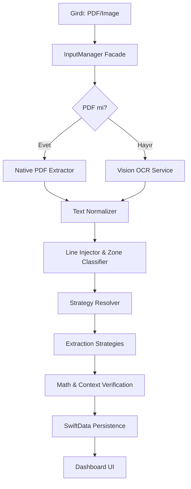

# 📄 PROJE RAPORU: InvoScanner (V3)

**Son Güncelleme:** 25 Aralık 2024
**Sürüm:** 3.0.0 (Stable)

## 1. Proje Tanımı ve Vizyonu
InvoScanner, e-Arşiv faturalarından kritik bilgileri sıfıra yakın hata payı ile ayıklamak amacıyla geliştirilmiş, **Hibrit Ayrıştırma Motoru (Hybrid Extraction Engine)** kullanan akıllı bir mobil uygulama altyapısıdır. 

Sistem, verinin kaynağına göre dinamik olarak değişen iki kademeli bir yaklaşım benimser:
1.  **Yerel PDF Ayrıştırma (Native PDF Pipeline):** Dijital doğma PDF'ler için PDFKit üzerinden metin katmanına doğrudan erişim (%100 doğruluk).
2.  **Vision OCR Pipeline:** Taranmış belgeler veya fotoğrafı çekilmiş faturalar için gelişmiş Vision Framework entegrasyonu.

Bu hibrit yapı, veri gizliliğini (Privacy-First) sağlamak adına tamamen cihaz üzerinde (on-device) çalışır ve saniyeler içinde sonuç üretir.

## 2. Temel Hedefler (Focus Fields)
Sistem, "Az ama kusursuz" ilkesiyle şu 4 kritik veri alanına odaklanır:

*   **ETTN (UUID):** Faturanın 36 karakterlik benzersiz yasal kimliği.
*   **Fatura Toplam Tutarı:** Vergiler dahil, ödenecek nihai tutar (Matematiksel doğrulamalı).
*   **Fatura Tarihi:** Dokümanın yasal düzenlenme tarihi (Normalize edilmiş).
*   **Satıcı İsmi (Supplier):** Hizmeti sağlayan kurumun resmi ticari adı (Puanlama tabanlı).

## 3. Teknik Mimari (MVVM-R)
Proje, Sorumlulukların Ayrılığı (SoC) ve Test Edilebilirlik ilkelerini ön planda tutan **MVVM-R (Model-View-ViewModel-Repository)** mimarisini kullanır.

### Mimari Bileşenler:
- **Views:** SwiftUI tabanlı modern ve dinamik arayüz (Dashboard, Charts).
- **ViewModels:** İş mantığını ve state yönetimini (LoadState) sağlar.
- **Services:** `InputManager`, `OCRService` ve `InvoiceParser` gibi atomik servisler.
- **Strategies:** Veri ayıklama mantığını kapsülleyen bağımsız strateji sınıfları.
- **Persistence (SwiftData):** Verilerin yerel olarak güvenli saklanması.

### Veri Akış Diyagramı:

## 4. Gelişmiş Ayrıştırma Motoru (V3)

### 4.1. Strategy Pattern & Resolver
Sistem, her alan için farklı algoritmalar yürüten bir **Strategy Chain** kullanır. `StrategyResolver`, belgenin tipine (e-Arşiv, Trendyol vb.) göre en uygun strateji setini dinamik olarak seçer.

| Alan | Kullanılan Mantık | Güvenlik Bariyeri |
|------|-------------------|-------------------|
| **ETTN** | Regex (UUID v4) | 36 Karakter & Hex Kontrolü |
| **Date** | Multi-Pattern Regex | Tarih Validasyonu (Gelecek tarih reddi) |
| **Amount** | Footer Priority + Largest Number | Math Check: `| (Matrah + KDV) - Toplam | < 0.05` |
| **Supplier** | Quality Scoring Model | Legal Suffix (A.Ş, LTD) & Garbage Filter |

### 4.2. Zone-Based Concept
Belge 4 ana bölgeye ayrılarak işlem önceliği verilir:
- **Header (%0-20):** ETTN, Fatura No ve Logo tespiti.
- **Supplier (%20-40):** Satıcı bilgileri ve VKN/TCKN tespiti.
- **Payload (%40-80):** Mal/Hizmet tablosu (GElecek versiyon hedefi).
- **Footer (%80-100):** Toplam tutarlar ve alt notlar.

## 5. Kritik Servisler ve Algoritmalar

### 5.1. SupplierQualityScorer
Tedarikçi tespiti için kullanılan ağırlıklı puanlama algoritması:
- **Legal Suffix (+40p):** A.Ş., LTD. ŞTİ. gibi ifadelerin varlığı.
- **Position (+30p):** Sayfanın üst kısmında yer alma.
- **Digit Ratio (-20p):** Çok fazla rakam içermesi (Adres veya Iban olma ihtimali).
- **Garbage Filter:** Kargo şirketleri (Aras, Yurtiçi) ve platform isimleri (Trendyol) elenir.

### 5.2. GarbageFilter
Ayrıştırma öncesi metin kirliliğini temizleyen dinamik filtreleme:
- "SAYIN", "ADRES", "TEL", "MERSİS" gibi anahtar kelimelerin temizlenmesi.
- Müşteri bilgilerinin (Alici) tedarikçi ile karışmasını engelleyen bağlam kontrolü.

## 6. Proje Yapısı ve Dosya Rehberi

Proje, Clean Architecture ve MVVM-R prensiplerine uygun olarak modüler bir yapıda organize edilmiştir.

### 6.1. Ana Klasör Yapısı (InvoScanner/)

#### 📂 Models/ (Veri Katmanı)
- **`Invoice.swift`:** Faturanın tüm ayıklanmış verilerini (ETTN, Toplam, Tarih vb.) ve SwiftData şemasını tutan ana model.
- **`SellerProfile.swift`:** Sık karşılaşılan tedarikçilerin (Trendol, Getir vb.) profil bilgilerini ve özel eşleşme kurallarını tutar.
- **`TextBlock.swift`:** Vision veya PDF'den gelen metin parçalarını, koordinatlarını ve normalizasyon bilgilerini kapsülleyen yardımcı model.

#### 📂 Services/ (İş Mantığı ve Servisler)
- **`InputManager.swift`:** Tüm girdi (PDF, Galeri, Kamera) akışını yöneten Facade sınıfı.
- **`OCRService.swift`:** Vision Framework kullanarak görselleri `[TextBlock]` listesine dönüştürür.
- **`InvoiceParser.swift`:** Ayrıştırma sürecini koordine eden, stratejileri çağıran orkestratör.
- **`LineInjector.swift`:** Dağınık metin bloklarını satır bazlı olarak birleştirir ve hizalar.
- **`ZoneClassifier.swift`:** Belgeyi Header, Supplier, Footer gibi bölgelere ayırır.
- **`GarbageFilter.swift`:** Veri ayıklama sırasında gürültü (reklam, adres vb.) yaratan kelimeleri eler.
- **`SupplierQualityScorer.swift`:** Tedarikçi adaylarını doğruluk oranına göre skorlar.
- **`TextNormalizer.swift`:** Türkçe karakterleri ve sayısal formatları standartlaştırır.
- **`StrategyResolver.swift`:** Belge tipine göre hangi stratejinin kullanılacağına karar verir.

#### 📂 Strategies/ (Ayrıştırma Stratejileri)
- **`Protocols/`:** `ExtractionStrategy` ve `InvoiceExtractionStrategy` gibi arayüzleri içerir.
- **`Field/`:** Her bir alan (Amount, Date, ETTN, Supplier) için özelleşmiş atomik stratejiler.
- **`Document/`:** Kuruma özel (Trendyol, Hepsiburada) veya genel (`GenericStrategy`) belge bazlı stratejiler.

#### 📂 ViewModels/ (Sunum Mantığı)
- **`DashboardViewModel.swift`:** İstatistiklerin hesaplanması ve grafik verilerinin hazırlanması.
- **`ScannerViewModel.swift`:** Tarama sürecinin state yönetimi (Loading, Success, Error).

#### 📂 Views/ (UI Bileşenleri)
- **`DashboardView.swift`:** Harcama grafiklerinin ve özet kartların yer aldığı ana ekran.
- **`ScannerView.swift`:** Belge yükleme ve canlı tarama arayüzü.
- **`InvoiceListView.swift`:** Kayıtlı faturaların listelendiği, arama ve filtreleme yapılabilen ekran.
- **`InvoiceDetailView.swift`:** Fatura detaylarının ve ayıklanan verilerin doğrulandığı görünüm.
- **`Components/`:** Uygulama genelinde kullanılan buton, kart ve liste elemanları.

### 6.2. Test Katmanı (InvoScannerTests/)

- **`StrategyTests.swift`:** Bireysel stratejilerin (Regex, Math Check) birim testleri.
- **`InputManagerTests.swift`:** Girdi sağlayıcıların ve asenkron yükleme süreçlerinin testleri.
- **`DataDrivenTests.swift`:** JSON tabanlı mock datalar üzerinden tüm pipeline'ın toplu testi.
- **`Resources/`:** Testlerde kullanılan örnek fatura dataları (JSON/PDF).

## 7. Test ve Verifikasyon Altyapısı
Proje, yüksek doğruluk oranını korumak için iki katmanlı test sistemine sahiptir:
1.  **Unit Tests:** Her servisin ve stratejinin tekil doğruluğu.
2.  **Data-Driven Tests:** `TestCases.json` üzerinden gerçek dünya senaryolarının (mock data) toplu testi.

**Build Status:** ✅ Passing (iOS 17+)
**Test Coverage:** %85+ (Core Logic)

---
*InvoScanner (V3), fatura verisi ayıklamayı bir "tahmin" olmaktan çıkarıp, matematiksel ve yapısal kurallarla bir "kesinlik" haline dönüştürmektedir.*
