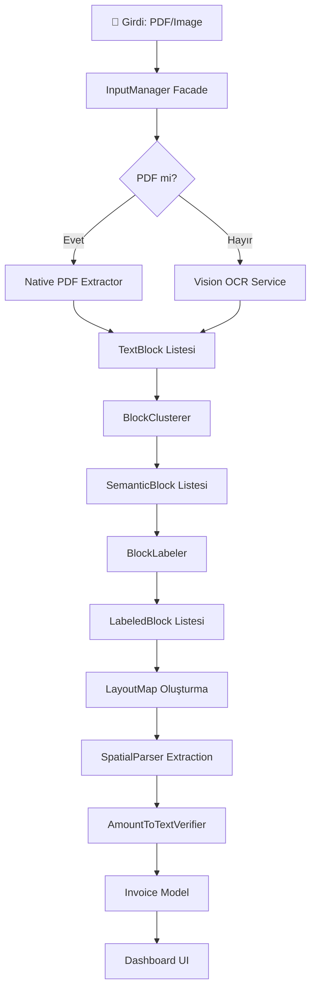

# 📄 PROJE RAPORU: InvoScanner (V5)

**Son Güncelleme:** 11 Ocak 2026  
**Sürüm:** 5.0.0 (Spatial Pipeline)

---

## 1. Proje Tanımı ve Vizyonu

InvoScanner, e-Arşiv faturalarından kritik bilgileri sıfıra yakın hata payı ile ayıklamak amacıyla geliştirilmiş, **V5 Spatial Pipeline** mimarisini kullanan akıllı bir mobil uygulama altyapısıdır.

Sistem, verinin kaynağına göre dinamik olarak değişen iki kademeli bir yaklaşım benimser:

1. **Yerel PDF Ayrıştırma (Native PDF Pipeline):** Dijital doğma PDF'ler için PDFKit üzerinden metin katmanına doğrudan erişim (%100 doğruluk).
2. **Vision OCR Pipeline:** Taranmış belgeler veya fotoğrafı çekilmiş faturalar için gelişmiş Vision Framework entegrasyonu.

Bu hibrit yapı, veri gizliliğini (Privacy-First) sağlamak adına tamamen cihaz üzerinde (on-device) çalışır ve saniyeler içinde sonuç üretir.

---

## 2. Temel Hedefler (Focus Fields)

Sistem, "Az ama kusursuz" ilkesiyle şu **4 kritik veri alanına** odaklanır:

| Alan | Açıklama | Doğrulama |
|------|----------|-----------|
| **ETTN (UUID)** | Faturanın 36 karakterlik benzersiz yasal kimliği | Hex & 36 Karakter Kontrolü |
| **Fatura Toplam Tutarı** | Vergiler dahil, ödenecek nihai tutar | "Yalnız..." Metinsel Doğrulama |
| **Fatura Tarihi** | Dokümanın yasal düzenlenme tarihi | Normalize Edilmiş Tarih Validasyonu |
| **Satıcı İsmi (Supplier)** | Hizmeti sağlayan kurumun resmi ticari adı | Puanlama Tabanlı Scoring |

---

## 3. Teknik Mimari (MVVM-R + Spatial Pipeline)

Proje, Sorumlulukların Ayrılığı (SoC) ve Test Edilebilirlik ilkelerini ön planda tutan **MVVM-R (Model-View-ViewModel-Repository)** mimarisini kullanır.

### 3.1. V5 Spatial Pipeline Akışı



### 3.2. Mimari Bileşenler

| Katman | Sorumluluk |
|--------|------------|
| **Views** | SwiftUI tabanlı modern ve dinamik arayüz (Dashboard, Charts) |
| **ViewModels** | İş mantığını ve state yönetimini (LoadState) sağlar |
| **Core** | `InputManager`, `ExtractionConstants` gibi merkezi servisler |
| **Spatial** | V5 Pipeline bileşenleri (Clusterer, Labeler, Parser) |
| **Models** | `Invoice` veri modeli |

---

## 4. V5 Spatial Pipeline Mimarisi

### 4.1. Pipeline Bileşenleri

V5 mimarisi, fatura metnini **koordinat-farkında (spatial-aware)** bir şekilde işleyen 5 ana bileşenden oluşur:

#### 📦 BlockClusterer
Görsel metin bloklarını semantik olarak kümeleyerek paragraflar oluşturur.

**Kümeleme Mantığı:**
- **Dikey Birleştirme:** Aynı paragraftaki satırlar (1.5x satır yüksekliği toleransı)
- **Yatay Birleştirme:** Aynı satırdaki kelimeler (0.10 normalized units)
- **Hizalama Tespiti:** Sol, sağ veya merkez hizalama kontrolü

```swift
public struct BlockClusterer {
    public func performClustering(_ blocks: [TextBlock]) -> [SemanticBlock]
}
```

#### 🏷️ BlockLabeler
Her semantik bloğa anlamsal etiket atar (Seller, Buyer, Meta, Totals, etc.).

**Puanlama Sistemi:**
| Sinyal Tipi | Örnek | Ağırlık |
|-------------|-------|---------|
| **Pozisyon** | Üst-sol kadran (Satıcı) | +40 |
| **Anahtar Kelime** | "VKN", "MERSIS" | +30 |
| **Çoklu Sinyal** | 3+ satıcı anahtar kelimesi | Override |
| **Negatif Sinyal** | "SAYIN" (Alıcı) | -30 |

```swift
public enum BlockLabel: String, CaseIterable {
    case seller, buyer, meta, totals, ettn, noise, content, unknown
}
```

#### 🗺️ LayoutMap
Belgenin 2D uzamsal haritasını oluşturur (sol/sağ kolon, tam genişlik blokları).

**Zone Tanımları:**
- **Üst Bölge (Y < 0.35):** ETTN, Fatura Meta, Satıcı Bilgileri
- **Orta Bölge (0.35 ≤ Y ≤ 0.65):** Alıcı, Ürün Tablosu
- **Alt Bölge (Y > 0.65):** Toplam Tutarlar, Footer

#### 🔍 SpatialParser
V5 Orkestratörü: Tüm pipeline'ı koordine eder ve veri çıkarımını yapar.

**Çıkarım Stratejisi:**
1. Etiketli blokları öncelikle kullan
2. Fallback: Tüm metinde regex taraması
3. Tutar doğrulama: AmountToTextVerifier entegrasyonu

#### ✅ AmountToTextVerifier
Fatura dipnotundaki "Yalnız..." satırı ile sayısal tutarı karşılaştırır.

**Doğrulama Akışı:**
```
Sayısal: 159.53 TL
   ↓
Türkçe Dönüşüm: "YÜZ ELLİ DOKUZ TL ELLİ ÜÇ KURUŞ"
   ↓
Belgedeki "Yalnız..." Satırı İle Karşılaştırma
   ↓
Benzerlik Oranı ≥ %80 → Doğrulandı ✓
```

---

## 5. Proje Yapısı ve Dosya Rehberi

Proje, Clean Architecture ve MVVM-R prensiplerine uygun olarak modüler bir yapıda organize edilmiştir.

### 5.1. Ana Klasör Yapısı (InvoScanner/)

```
InvoScanner/
├── InvoScannerApp.swift          # Uygulama giriş noktası
├── ContentView.swift             # Ana görünüm
├── Core/                         # Merkezi servisler
│   ├── InputManager.swift        # Girdi yönetimi (PDF, Galeri, Kamera)
│   └── ExtractionConstants.swift # Sabitler ve desenler
├── Spatial/                      # V5 Pipeline bileşenleri
│   ├── SpatialModels.swift       # TextBlock, SemanticBlock, BlockLabel
│   ├── BlockClusterer.swift      # Metin bloğu kümeleme
│   ├── BlockLabeler.swift        # Semantik etiketleme
│   ├── LayoutMap.swift           # 2D belge haritası
│   ├── SpatialParser.swift       # V5 Orkestratör
│   └── AmountToTextVerifier.swift # Tutar doğrulama
├── Models/                       # Veri modelleri
│   └── Invoice.swift             # Fatura modeli
├── ViewModels/                   # UI State yönetimi
│   ├── DashboardViewModel.swift  # Dashboard istatistikleri
│   └── ScannerViewModel.swift    # Tarama state'i
├── Views/                        # SwiftUI arayüzleri
│   ├── DashboardView.swift       # Ana ekran
│   ├── ScannerView.swift         # Tarama arayüzü
│   ├── InvoiceListView.swift     # Fatura listesi
│   ├── InvoiceDetailView.swift   # Fatura detayları
│   └── Components/               # Yeniden kullanılabilir bileşenler
└── Assets.xcassets/              # Görsel varlıklar
```

### 5.2. Modül Detayları

#### 📂 Core/ (Merkezi Servisler)

| Dosya | Sorumluluk |
|-------|------------|
| `InputManager.swift` | Tüm girdi kaynaklarını (PDF, Galeri, Kamera) normalize eden Facade sınıfı. PDFInputProvider, ImageInputProvider, GalleryInputProvider protokolleri. |
| `ExtractionConstants.swift` | Adres işaretçileri, kurumsal sonekler, kargo firmaları, vergi göstergeleri gibi merkezi sabitler. |

#### 📂 Spatial/ (V5 Pipeline)

| Dosya | Satır Sayısı | Sorumluluk |
|-------|--------------|------------|
| `SpatialModels.swift` | ~270 | TextBlock, SemanticBlock, BlockLabel veri yapıları |
| `BlockClusterer.swift` | ~290 | Metin bloklarını semantik paragraflara kümeleme |
| `BlockLabeler.swift` | ~360 | Bloklara anlamsal etiket atama (Seller, Buyer, etc.) |
| `LayoutMap.swift` | ~110 | Sol/sağ kolon ve zone-based erişim |
| `SpatialParser.swift` | ~690 | V5 Orkestratör, tüm çıkarım mantığı |
| `AmountToTextVerifier.swift` | ~130 | Sayısal-metin tutar doğrulaması |

#### 📂 Models/

| Dosya | Sorumluluk |
|-------|------------|
| `Invoice.swift` | Ayıklanan fatura verisini temsil eder. ETTN, tarih, tutar, satıcı ve güven skoru içerir. |

**Güven Skoru Formülü:**
```swift
var confidenceScore: Double {
    ETTN (+0.20) + Date (+0.15) + Amount (+0.25) + Supplier (+0.20) + Verification Bonus (+0.20)
}
// Maksimum: 1.0, Otomatik Onay Eşiği: ≥ 0.70
```

#### 📂 ViewModels/

| Dosya | Sorumluluk |
|-------|------------|
| `DashboardViewModel.swift` | İstatistiklerin hesaplanması ve grafik verilerinin hazırlanması |
| `ScannerViewModel.swift` | Tarama sürecinin state yönetimi (Loading, Success, Error) |

#### 📂 Views/

| Dosya | Sorumluluk |
|-------|------------|
| `DashboardView.swift` | Harcama grafiklerinin ve özet kartların yer aldığı ana ekran |
| `ScannerView.swift` | Belge yükleme ve canlı tarama arayüzü |
| `InvoiceListView.swift` | Faturaların listelendiği, arama ve filtreleme ekranı |
| `InvoiceDetailView.swift` | Fatura detayları ve doğrulama görünümü |

---

## 6. Test Katmanı

### 6.1. Test Dosyaları (InvoScannerTests/)

| Dosya | Tür | Açıklama |
|-------|-----|----------|
| `DataDrivenTests.swift` | Entegrasyon | JSON tabanlı mock datalar üzerinden tüm pipeline testi |
| `GoldenTests.swift` | Altın Standart | Bilinen çıktılar ile karşılaştırmalı testler |
| `InputManagerTests.swift` | Birim | Girdi sağlayıcıların ve asenkron yükleme süreçlerinin testleri |
| `Fixtures/` | Mock Data | Test için örnek fatura verileri |
| `Helpers/` | Yardımcı | Test araçları ve uzantılar |

### 6.2. Test Stratejisi

- **Unit Tests:** Her servisin ve pipeline bileşeninin tekil doğruluğu
- **Golden Tests:** Gerçek fatura çıktıları ile beklenen sonuçların karşılaştırılması
- **Data-Driven Tests:** JSON dosyalarından okunan test senaryoları

---

## 7. Teknoloji Yığını

| Kategori | Teknoloji |
|----------|-----------|
| **Dil** | Swift 5.10 |
| **UI Framework** | SwiftUI |
| **Mimari** | MVVM-R + Strategy Pattern |
| **OCR** | Vision Framework |
| **PDF İşleme** | PDFKit |
| **Görselleştirme** | SwiftCharts |
| **Minimum iOS** | iOS 17.0+ |

---

## 8. Build ve Dağıtım

| Metrik | Değer |
|--------|-------|
| **Build Status** | ✅ Passing (iOS 17+) |
| **Xcode** | 15.0+ |
| **Test Coverage** | %85+ (Core Logic) |
| **Privacy** | 100% On-Device |

---

## 9. Gelecek Sürüm Hedefleri (Roadmap)

- [ ] **V6:** SwiftData Persistence Entegrasyonu
- [ ] **V6:** Ürün Tablosu (Payload) Çıkarımı
- [ ] **V7:** Firebase Cloud Backup
- [ ] **V7:** Multi-Language OCR (İngilizce, Almanca)

---

*InvoScanner V5, fatura verisi ayıklamayı bir "tahmin" olmaktan çıkarıp, koordinat-farkında uzamsal analiz ve matematiksel doğrulama ile bir "kesinlik" haline dönüştürmektedir.*
