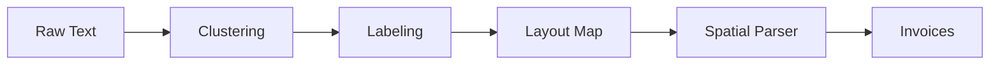

# 🚀 InvoScanner

**InvoScanner**, e-Arşiv faturalarını yapay zeka ve konumsal analiz teknikleriyle işleyen, verileri tamamen cihaz üzerinde (on-device) ayıklayan yüksek performanslı bir iOS fatura yönetim sistemidir. Modern **Liquid Glass** tasarım diliyle geliştirilen uygulama, gizlilikten ödün vermeden fatura süreçlerini dijitalleştirir.

[](https://swift.org)
[](https://www.apple.com/ios/)
[](https://developer.apple.com/documentation/vision)
[](https://developer.apple.com/documentation/swiftdata)

---

## ✨ Temel Özellikler

- 🧠 **Spatial Engine v6:** Koordinat tabanlı metin analizi ile fatura üzerindeki verileri konumsal olarak doğrular.
- 🛡️ **Privacy-First:** OCR ve veri analizi süreçlerinin tamamı cihaz üzerinde gerçekleşir; veri sızıntısı riski yoktur.
- 📐 **Semantic Labeling:** Belgeyi otomatik olarak Satıcı, Alıcı, Meta ve Toplamlar bölgelerine ayırır.
- 🧪 **Çapraz Doğrulama:** Sayısal tutarları, fatura üzerindeki metinsel ibarelerle ("Yalnız...") matematiksel olarak karşılaştırır.
- 📊 **Akıllı Dashboard:** Swift Charts ile harcama trendlerini ve aylık istatistikleri görselleştirir.
- 💎 **Liquid Glass UI:** Modern cam efekti ve dinamik arka planlarla premium kullanıcı deneyimi sunar.

---

## 🏗️ Teknoloji Yığını

| Bileşen | Teknoloji |
|----------|-----------|
| **Kullanıcı Arayüzü** | SwiftUI (Declarative UI) |
| **İş Mantığı** | Swift Concurrency & MVVM |
| **OCR / Analiz** | Apple Vision Framework |
| **Veri Saklama** | SwiftData (Persistence Layer) |
| **Dinamik Grafikler** | Swift Charts |

---

## 🔬 Spatial Pipeline Mimarisi

InvoScanner, ham OCR çıktılarını işlemek için özel bir işlem hattı (pipeline) kullanır:



- **BlockClusterer**: Dağınık metin bloklarını geometrik yakınlıklarına göre paragraflara dönüştürür.
- **BlockLabeler**: Konum ve içerik sinyalleriyle blokların semantik görevlerini belirler.
- **LayoutMap**: Belgenin hiyerarşik haritasını (Sol/Sağ/Orta Kolon) oluşturur.
- **SpatialParser**: Tüm sinyalleri birleştirerek kesin verileri (ETTN, VKN, Tutar) ayıklar.

---

## � Dosya Yapısı

```
InvoScanner/
├── Core/           # Servis yönetimi ve merkezi sabitler
├── Spatial/        # Ayrıştırma motoru (Engine v6)
├── Models/         # SwiftData ve API modelleri
├── ViewModels/     # Reaktif iş mantığı katmanı
├── Views/          # SwiftUI ekranları ve Liquid Glass bileşenleri
└── Assets/         # SF Symbols ve görsel varlıklar
```

---

## 🛠️ Kurulum ve Çalıştırma

### Gereksinimler
- **Xcode 15.4+**
- **iOS 17.0+**
- **macOS Sonoma+**

### Başlangıç
1. Projeyi klonlayın:
   ```bash
   git clone https://github.com/bilalelmas/InvoScanner.git
   ```
2. `InvoScanner.xcodeproj` dosyasını açın.
3. Apple Vision Framework ve SwiftData özelliklerinin tam performanslı çalışması için gerçek bir fiziksel cihaz veya en güncel simülatörü kullanın.

---

## 🧪 Test Stratejisi

Uygulama, veri çıkarma doğruluğunu korumak için kapsamlı test setlerine sahiptir:

```bash
# Terminal üzerinden testleri tetiklemek için:
xcodebuild test -scheme InvoScanner -destination 'platform=iOS Simulator,name=iPhone 15'
```

- **DataDrivenTests**: Farklı fatura formatları için toplu doğruluk testleri.
- **GoldenTests**: Belirlenmiş "Golden Data" setleri üzerinden regresyon testleri.
- **UnitTests**: Core ve Spatial modüllerin birim testleri.

---

## � Yol Haritası (Roadmap)

- [x] Spatial Engine v6 Entegrasyonu
- [x] Liquid Glass Tasarım Sistemi
- [x] SwiftData Yerel Depolama
- [ ] Ürün Tablosu (Line Items) Detaylı Analizi
- [ ] Çoklu PDF Sayfası Desteği
- [ ] Bulut Senkronizasyonu (iCloud)

---

*Geliştirici: **[Bilal Elmas](https://github.com/bilalelmas)***  
*Lisans: MIT*
