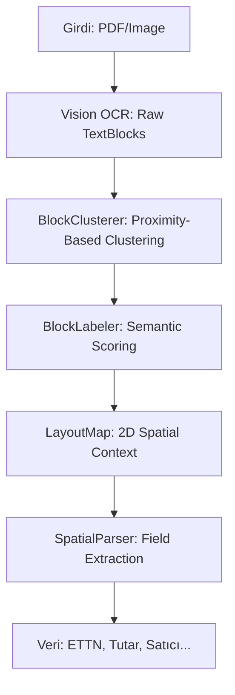

# InvoScanner: On-Device Spatial-Aware Invoice Parsing Engine
## Teknik Mimari ve Uygulama Raporu

**Hazırlayan:** Bilal Elmas  
**Proje:** InvoScanner (iOS Fatura Yönetim Sistemi)  
**Kapsam:** Bitirme Tezi Değerlendirme Dokümantasyonu  

---

### 1. Proje Özeti (Executive Summary)

**InvoScanner**, e-Arşiv ve fiziksel faturalardan kritik verileri (ETTN, Tarih, Tutar, Satıcı, Alıcı vb.) yüksek doğrulukla ayıklayan, modern iOS teknolojileri üzerine kurgulanmış bir sistemdir. Ticari OCR çözümlerinin aksine, tüm veri işleme süreçlerini tamamen **cihaz üzerinde (on-device)** gerçekleştirerek veri gizliliğini (Privacy-First) en üst düzeyde tutar. Projenin kalbi, metin bloklarını sadece içerik olarak değil, 2B koordinat düzlemindeki konumlarına göre de analiz eden **Spatial Pipeline** mimarisidir.

---

### 2. Teknik Mimari (Technical Architecture)

Proje, Apple'ın modern geliştirme standartlarına uygun olarak **MVVM-R (Model-View-ViewModel + Router)** mimarisi ve **SwiftData** persistence katmanı üzerine inşa edilmiştir.

#### Mimari Katmanlar:
- **UI Katman (SwiftUI):** iOS 26 "Liquid Glass" tasarım diline uygun, dinamik ve interaktif arayüz.
- **Processing Katman (Vision Framework):** Apple'ın sinir ağı tabanlı Vision kütüphanesi ile yüksek performanslı metin tanıma (OCR).
- **Extraction Katman (Spatial Pipeline):** Projenin özgün "Spatial-Aware" veri ayıklama algoritması.
- **Persistence Katman (SwiftData):** Hibrit depolama (Görseller diskte, metadata veritabanında).

---

### 3. Spatial Pipeline Algoritması

Sıradan OCR sistemleri metni tek boyutlu bir string olarak işlerken, InvoScanner metni bir **Layout Map (Yerleşim Haritası)** olarak görür.

#### Pipeline Aşamaları:

1.  **BlockClusterer (Kümeleme):** Ham metin bloklarını, satır yüksekliği ve yatay yakınlık parametrelerine (Greedy Merge) göre mantıksal paragraflara dönüştürür. Sütun sınırlarını korumak için yatay mesafe kısıtları (Column Separation) uygular.
2.  **BlockLabeler (Etiketleme):** Her bloğa semantik bir kimlik atar. Puanlama sistemi şu kriterleri kullanır:
    *   **Konumsal Skor:** Faturanın kadranlarına (sol-üst: satıcı, sağ-üst: meta, vb.) göre ağırlıklandırma.
    *   **İçerik Skoru:** Anahtar kelime eşleşmesi (Ağırlıklı Sözlük).
    *   **Negatif Sinyal:** Çelişen kelimelerin (örn: Satıcı bloğunda "Sayın" geçmesi) puan düşürmesi.
3.  **AmountToTextVerifier (Çapraz Doğrulama):** Ayıklanan sayısal tutar ile faturadaki "Yalnız..." ibaresiyle başlayan metinsel tutarı karşılaştırarak **Confidence Score (Güven Skoru)** üretir.
4.  **Advanced Heuristics (Gelişmiş Sezgisel Yöntemler):**
    *   **Smart Scissors (Akıllı Kesme):** Kelime bazlı OCR sonuçlarını, karakter bazlı yapısal analizle (regex + spatial) birleştirerek hata oranını düşürür.
    *   **Cargo & Junk Filter:** Fatura üzerindeki reklam metinleri, kargo takip numaraları gibi gürültü verileri (noise) temizleyerek ana veriye odaklanır.

---

### 4. Veri Güvenliği ve Gizlilik

Proje, GDPR ve KVKK uyumluluğu açısından kritik olan şu özellikleri sağlar:
- **Zero-Cloud Dependency:** OCR ve parsing süreci için OpenAI/Google Vision gibi bulut servislerine ihtiyaç duymaz.
- **Local Data Storage:** Tüm hassas fatura verileri cihazın Secure Sandbox alanında saklanır.
- **Hybrid Storage Strategy:** Yüksek çözünürlüklü görseller dosya sisteminde (`FileManager`), metadata ise şifrelenmiş veritabanında (`SwiftData`) asimetrik olarak tutulur.

---

### 5. UI/UX Tasarım İlkeleri

Uygulama, **iOS 26 Liquid Glass** tasarım dilini temel alan "Aurora UI" konseptine sahiptir:
- **Mesh Gradients:** `CrystalBackground` ile dinamik arka plan efektleri.
- **Ultra-Thin Materials:** SwiftUI `.ultraThinMaterial` ile cam şeffaflığı.
- **PhotosPicker & DocumentCamera:** Apple'ın en güncel API'leri ile hibrit dosya yükleme desteği.

---

### 6. Mevcut Durum ve Gelecek Çalışmalar

**Tamamlananlar:**
- [x] Spatial Clustering & Labeling altyapısı.
- [x] %90+ doğruluk oranı ile veri çıkarımı (benchmark testleri baz alınarak).
- [x] Hibrit veri saklama mimarisi.
- [x] Modern kullanıcı arayüzü.

**Gelecek Hedefler:**
- [ ] Satır bazlı (Line-Item) ürün çıkarımı.
- [ ] Farklı diller (İngilizce, Almanca) için lokalizasyon ve adaptasyon.
- [ ] Daha karmaşık tablo yapılarının (Grid Analysis) çözülmesi.

---
*Bu doküman projenin teknik olgunluk düzeyini ve akademik altyapısını özetlemek amacıyla hazırlanmıştır.*
